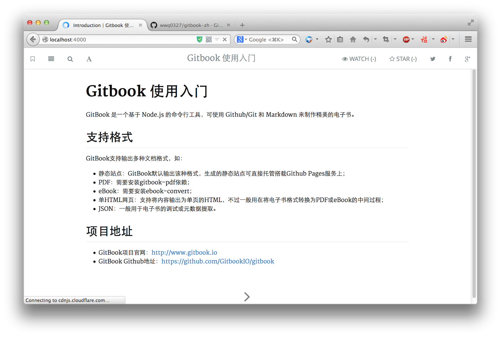

输出为静态网站
====

你有两种方式输出一个静态网站：

**本地预览时自动生成**

当你在自己的电脑上编辑好图书之后，你可以使用Gitbook的命令行进行本地预览：

```
E:\gitbook\gitbook-studying>gitbook serve ./图书目录
```

这里会启动一个端口为`4000`用于预览的服务器：

```
E:\gitbook\gitbook-studying> gitbook serve .
Press CTRL+C to quit ...

Starting build ...
Successfuly built !

Starting server ...
Serving book on http://localhost:4000
```

你可以你的浏览器中打开这个网址：<http://localhost:4000>：



这里你会发现，你在你的图书项目的目录中多了一个名为`_book`的文件目录，而这个目录中的文件，即是生成的静态网站内容。

**使用build参数生成到指定目录**

与直接预览生成的静态网站文件不一样的是，使用这个命令，你可以将内容输入到你所想要的目录中去,步骤如下：

1. mkdir outbook
2. cd..,退到上一层目录，即E:\gitbook   (如果不，会出错)
3. 然后,E:\gitbook>gitbook build gitbook-studying gitbook-studying/outbook
4. 则在 E:\gitbook\gitbook-studying\outbook下生成了同样的静态html文件


无论哪种方式，你都可以将这个文件打包，然后把你的书发给你的朋友们了！


